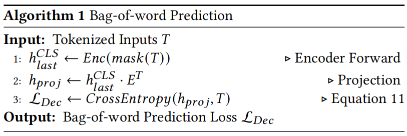
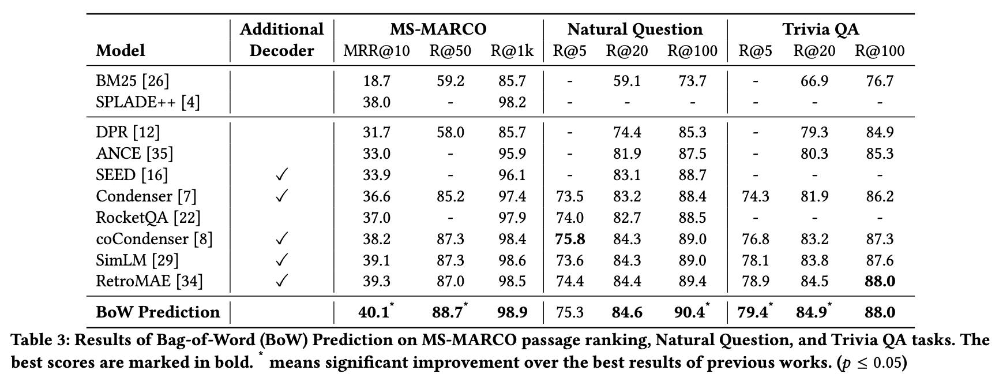
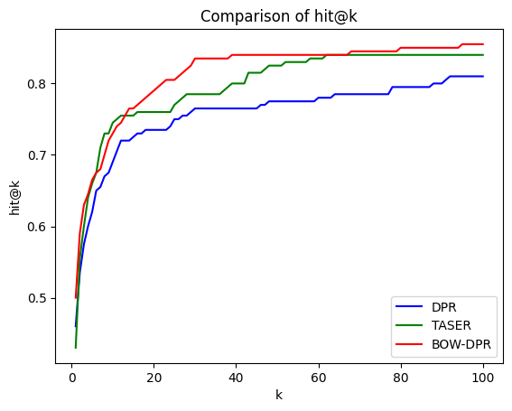

# IR 大作业 实验报告

## 技术选型

本实验中，我们选择了 **SIGIR 24** 的论文《Drop your Decoder: Pre-training with Bag-of-Word Prediction for Dense Passage Retrieval》中提出的 **BOW-DPR** 作为检索模型。论文链接如下：[https://arxiv.org/abs/2401.11248](https://arxiv.org/abs/2401.11248)。下文将依据论文中的内容对该方法进行简要概述。

### BOW-DPR 简介

**BOW-DPR** 提出了一种全新的预训练范式，即 **词袋（Bag-of-Word, BOW）预测任务**，用于直接将词汇项压缩为密集表示。其核心方法是将密集表示投影到词汇空间，并利用多标签交叉熵损失预测输入的词袋，从而将输入词汇的信息直接嵌入到密集表示中。这种预训练策略为下游检索任务中的语言模型（PLMs）提供了更高效的初始化能力，并可以完全取代传统的 **掩码自动编码器（MAE）** 预训练范式。

相比于传统的 MAE 预训练，BOW-DPR 具有以下优势：

- 零计算复杂度：无需额外的基于 Transformer 的解码器层、GPU 内存消耗、数据预处理或复杂的数据掩码操作，显著降低了预训练的计算成本。
- 高可解释性：相比于对解码器任务进行复杂修改的 MAE 式预训练，BOW-DPR 不依赖解码器，而是直接通过优化输入词袋的多标签预测任务来训练模型。

与此同时，通过在多个大规模的网页搜索和开放域问答数据集 (MS-MARCO, Natural Questions, TriviaQA) 上进行实验，证明了 BOW-DPR 不仅**提升了训练速度**，并且**实现了最佳的检索性能**。

以下内容将分别介绍：传统 MAE 预训练的局限性和 BOW-DPR 的核心设计及其优势。

### **传统 MAE 预训练的局限性**

密集检索预训练利用一个编码器$Enc$生成查询$q$和段落$p$作为句子$v_q$和$v_p$的表示（通常，这些表示来自于 [CLS] 词元位置上的最后一个隐藏状态，即$h^{CLE}_{last}$），然后用点积或余弦相似度计算$v_q$和$v_p$的相似度$Sim(q,p)$：

$$
Sim(q,p)=Enc(q)\cdot Enc(p)=v_q\cdot v_p
$$

**掩码自动编码器（Masked Auto-Encoder，MAE）**预训练是一种有效的模式，可以将可持续的监督信号带到编码器的句子表示中，并提高后续微调的检索性能。

1. 首先，对于从训练语料库集合中给出一个标记化文本$t\in T$，MAE 预训练首先按照预定义的掩码比例 $r_{\text{Enc}}$对一定比例的词元进行选择，并将这些词元替换为掩码词元 [m]。掩码后的文本形式为：

$$
mask(t)=\left\{ [CLS],t_1,t_2,[m],t_4,\cdots,t_n,[SEP]\right\}
$$

1. 此后，将掩码文本$mask(t)$通过编码器$Enc$前向传播，以优化具有交叉熵损失形式的掩码语言模型（Masked Language Model，MLM）任务损失$\mathcal{L}_{Enc}$，其中，$M$表示掩码词元的集合。

$$
\begin{aligned}
\mathcal{L}_{\text{Enc}} &= CE(Enc(\text{mask}(t)), t_i), \, i \in M \\
&= -\sum{t \in T} \sum_{i \in M} \log p(t_i | Enc(\text{mask}(t)))
\end{aligned}
$$

**解码器设计**是 MAE 式预训练的关键创新，主要有三种模式：自动编码、自动回归和增强解码。

1. 自动编码解码器
   - 给定文本$t_{Dec}$作为解码器输入，自动编码解码器首先用较大的掩码比率$r_{Dec}$进行掩码，且$r_{Dec}$满足$r_{Dec}>r_{Enc}$，并用编码器表示替换第一个词元。

$$
mask(t_{Dec})=\left\{ h^{CLS}_{last},t_1,t_2,[m],t_4,\cdots,t_n,[SEP]\right\}
$$

$$
\mathcal L_{Dec}=CE(Dec(mask(t_{Dec})),t_i),i\in M
$$

1. 自动回归编码器
   - 给定文本$t_{Dec}$作为解码器输入，使用自动编码解码器相同的方式对输入进行掩码。
   - 使用自回归语言模型（CLM）损失作为解码器的生成信号，并通过交叉熵（CE）损失实现。编码器表示将通过解码器生成的梯度流，从解码器传递到编码器进行优化。

$$
\begin{aligned}
\mathcal{L}_{Dec} &= \text{CE}\left( \text{Dec}(t_{Dec}[:i-1]), t_i \right), \quad i \in (0,n] \\
&= -\sum_{t_i \in T_{Dec}} \log p(t_i \mid \text{Dec}(t_{Dec}[:i-1]))
\end{aligned}
$$

1. 增强解码解码器
   - 与自动编码或自动回归解码器不同，增强解码器通过交叉注意机制和极端掩码比率来提高词元使用效率。解码器输入$t_{Dec}$首先通过嵌入层转化为输入嵌入$h^{Emb}_{Dec}$。然后增强编码利用有位置嵌入$p$的编码器表示$h^{CLE}_{last}$作为查询$q$，将输入嵌入$h^{Emb}_{Dec}$作为$k$和$v$。

$$
q=h^{CLE}_{last}+p\\ k=v=h^{Emb}_{Dec}
$$

$$
A = \text{softmax}\left( \frac{q^T k}{\sqrt{d}} + M \right) \cdot v\\ h_{Dec}=LN(FFN(A)+A)
$$

$$
\mathcal L_{Dec}=CE(h_{Dec}E^T,t_i),i\in [0,n]
$$

上述三种解码器设计都是针对密集检索的掩码自动编码器（MAE）预训练的主流模式。它们为编码器表示提供了丰富的监督信号，并使下游检索任务能够实现更好的初始化。然而，MAE 预训练的有效性**缺乏可解释性**，并且由于**需要额外的基于 Transformer 的解码器**层而带来了额外的$O(n^2)$复杂性。

### BOW-DPR 的核心设计及其优势

BOW-DPR 使用**词袋（Bag-of-Word, BOW）预测**预训练方案，该方案去除了现有 MAE 预训练中必需的解码器。算法流程如下：



1. 首先使用 BERT 语言模型头部（即其嵌入矩阵$E_T$）将 [CLS] 词元位置的句子表示投影到词汇空间。
2. 然后，应用多标签交叉熵损失直接预测输入词元集$T$。词袋预测损失如下：

$$
\mathcal{L}_{\text {Dec}}=CE\left(h_{\text {last}}^{CLS} E^{T}, T\right)
$$

1. 最终目标函数包含编码器的掩码语言模型（MLM）损失和词袋预测损失：

$$
\mathcal{L}=\mathcal{L}_{Enc}+\mathcal{L}_{Dec}
$$

该设计方法有以下优点：

- 首先，词袋预测是一种**极其简单地将输入词汇信息直接压缩为密集表示**的方式，它仅利用现有的 BERT 语言模型头部进行投影。
- 其次，它**无需额外的基于 Transformer 的解码器层**、数据预处理或大规模的数据掩码操作，与其他复杂的 MAE 预训练相比，**不会带来任何额外的计算复杂度**。
- 此外，与以往主要侧重于对解码器任务进行大量修改的 MAE 预训练不同，词袋预训练仅涉及一个简单的词汇预测任务，它在压缩表示和词汇特征之间建立了联系，**具有很高的可解释性**且**易于实现**。

与此同时，BOW-DPR 在**多个大规模检索基准上达到了最先进的检索性能**，在 MS-MARCO 上比最强基准提高了 +0.8%（MRR@10）和 +1.7%（R@50），在 NQ 上提高了 +1.0%（R@100），在 TriviaQA 上提高了 +0.5%（R@5 和 R@20）。



## 运行命令

以下是"实验步骤"部分的简化版流程，为便于评阅，所提供的命令基于提交文件进行了简化处理。

### 运行准备

提交文件的目录树如下：

```bash
.
├── BOW-DPR                       # 实验代码目录
│   ├── BOW-DPR-ft-webq          # 在 WebQ 数据集微调后的模型
│   ├── data                     # 预处理后的数据
│   ├── experiment               # 实验相关的文件和脚本
│   ├── README.md                # 说明文档
│   ├── setup.py                 # Python包的安装和依赖管理脚本
│   └── src                      # 源代码部分
├── result_hit@k.csv             # hit@k指标结果
├── result.jsonl                 # 完整测试结果
└── 实验报告.pdf                 # 实验报告
```

相较于上传至 GitHub 的代码文件，提交文件额外包含了**预处理后的数据集**、**微调后的模型**以及**测试输出结果文件**，因此可以跳过“实验步骤”中的部分步骤，以便进行测试。

然而，仍需按照“实验步骤-环境配置”进行环境配置，相关命令如下：

```bash
# 创建并激活虚拟环境
conda create -n bowdpr python=3.9.12
conda activate bowdpr

# 安装依赖
cd /path/to/BOW-DPR # 主项目路径(实验代码目录)
pip install -e .
```

在环境配置完毕后，**提供了两种类型的快速测试方法**。

### Type 1: 基于完整结果文件

提交文件中提供了模型训练并推理后得到的输出结果文件，此文件中记录了测试集上每一个查询的详细检索结果，可直接通过结果文件统计指标值。

```bash
# 当前路径为主路径：/path/to/BOW-DPR
cd ./experiment
python evaluate_dpr_retrieval.py --retrieval ../../result.jsonl --save ../results/test_output/result.jsonl
```

运行命令后，主目录下会生成 results/test_output 文件夹，文件夹中包含 result_hit@k.csvmailto:result_hit@k.csv 和 result.jsonl 文件。其中 result_hit@k.csvmailto:result_hit@k.csv 文件即为基于结果文件统计的各个 Topk 位置的命中率，与后文"实验结果"部分报告的结果相吻合。

<u>注：结果文件的详细描述见"实验步骤-模型测试"</u>

### Type 2: 基于微调后的模型

提交文件中同时也提供了微调后的模型，可以从微调后的模型开始，先在测试集上进行推理测试，之后根据推理的结果计算相应指标值。

```bash
# 当前路径为主路径：/path/to/BOW-DPR
cd ./experiment
# bash test.sh ${MODEL_PATH} ${OUTPUT_DIR}
bash test.sh ../BOW-DPR-ft-webq ../results/test_model
```

运行命令后，主目录下会生成 results/test_model 文件夹，存放相应的结果文件，结果同样与后文"实验结果"部分报告的结果相吻合。（在本实验的环境和默认的超参数下，测试集的推理过程需要约 4 min 左右）

<u>注：上述步骤实际上对应了后文“实验步骤”中的“环境配置”和“模型测试”两个子部分，跳过了模型训练部分。如果时间和资源允许，可以按照完整的实验步骤进行复现。由于实验中</u>**设置了固定的随机数种子，完整复现的结果将与报告中的结果一致**<u>，这也间接</u>**证明了在实验过程中，测试集的数据未参与模型的训练**<u>。</u>

## 实验步骤

### 初始代码

#### 一键式命令

```bash
git clone https://github.com/PrettyMagnolia/BOW-DPR.git
```

<u>注：提交文件中已经包含代码文件，故可跳过此步骤。</u>

#### 详细描述

本实验代码参考了《Drop your Decoder: Pre-training with Bag-of-Word Prediction for Dense Passage Retrieval》论文的官方代码库：[https://github.com/ma787639046/bowdpr](https://github.com/ma787639046/bowdpr)。

在源代码库的基础上，新增了**对 WebQ 数据集的支持**，并且编写了新的**模型训练、测试、评估、输出结果的相关脚本**，以完成实验。实验代码已上传 Github：[https://github.com/PrettyMagnolia/BOW-DPR](https://github.com/PrettyMagnolia/BOW-DPR)。

初始代码文件夹的目录树结构如下：

```bash
.
├── experiment                       # 实验相关的脚本和文件夹
│   ├── annotate.py                  # 数据注释脚本
│   ├── clean_temp.py                # 清理临时文件的脚本
│   ├── evaluate_dpr_retrieval.py    # 评估模型检索效果的脚本
│   ├── nohup.out                    # 运行过程中输出的日志文件
│   ├── prepare_data.py              # 数据准备脚本
│   ├── prepare_data.sh              # 数据准备的shell脚本
│   ├── qa_utils.py                  # 问答系统相关的工具函数
│   ├── test.sh                      # 测试的shell脚本
│   └── train.sh                     # 训练的shell脚本
├── README.md                        
├── setup.py                         
└── src                              # 源代码目录
    ├── bowdpr                       
    │   ├── finetune                 # 微调模块
    │   │   ├── arguments.py         # 参数配置文件
    │   │   ├── data_utils.py        # 数据处理工具函数
    │   │   ├── encode.py            # 编码模块
    │   │   ├── fit.py               # 模型训练脚本
    │   │   ├── __init__.py          # 模块初始化文件
    │   │   ├── metrics.py           # 评估指标计算文件
    │   │   ├── modeling.py          # 模型定义文件
    │   ├── __init__.py              # 模块初始化文件
    │   ├── pretrain                 # 预训练模块(实验未使用)
    │   ├── rerank                   # 重排序模块
    │   │   ├── arguments.py         # 重排序的参数配置文件
    │   │   ├── data_utils.py        # 数据处理工具函数
    │   │   ├── fit.py               # 重排序训练脚本
    │   │   ├── __init__.py          # 模块初始化文件
    │   │   ├── __main__.py          # 重新排序模块的主入口
    │   │   └── modeling.py          # 模型定义文件
    │   ├── retriever                # 检索模块
    │   │   ├── faiss_retriever.py   # 使用Faiss进行检索的实现
    │   │   ├── __init__.py          # 模块初始化文件
    │   ├── scheduler.py             # 训练过程中学习率调度器
    │   ├── trainer.py               # 模型训练脚本
    │   └── utils                    # 工具函数模块
    │       ├── build_train_hn.py    # 构建训练所需的困难负样本
    │       ├── data_utils.py        # 数据处理工具函数
    │       ├── __init__.py          # 模块初始化文件
    │       ├── preprocessor.py      # 数据预处理函数
    └── bowdpr.egg-info
```

### 环境配置

#### 一键式命令

```bash
# 创建并激活虚拟环境
conda create -n bowdpr python=3.9.12
conda activate bowdpr

# 安装依赖
cd /path/to/BOW-DPR # 主项目路径
pip install -e .
```

<u>注：如果 cuda 版本和实验中所使用的版本不匹配，可能需要额外调整其他依赖的版本。</u>

#### 详细描述

完成本实验的实验环境为：

- 操作系统: Linux Ubuntu 5.15.0
- GPU: NVIDIA H100 80GB HBM3
- 运行环境: python 3.9.12, torch 2.1.0, cuda 12.2

（本文所有提到的运行时间预估均基于此实验环境设置）

### 数据准备

#### 一键式命令

首先在主目录下**创建 ori_data 文件夹，放入课程网站中的原始语料库和数据集**。

```bash
# 当前目录为主目录 /path/to/BOW-DPR
cd ./experiment
bash prepare_data.sh
```

运行命令后，主目录下会生成 data 文件夹，存放预处理后的数据集。

<u>注：提交文件中已经包含预处理后的数据，故可跳过此步骤。</u>

#### 详细描述

##### 原始数据格式

实验中使用的原始数据为课程网站中 IR_2024_Project.zip 文件中所提供原始 wiki 语料库，以及抽样后的 WebQ 数据集，存放于 oridata 文件夹中，包括：

```bash
.
├── webq-dev.json
├── webq-test.csv
├── webq-test.txt
├── webq-train.json
└── wiki_webq_corpus.tsv
```

原始语料及数据集的详细格式为：

1. 语料库为 tsv 文件，格式如下：

```bash
id        text        title
18        "in the Haggadah, was of a wonderful tranquility. Accompanied by Moses, his brother, and by Eleazar, his son, Aaron went to the summit of Mount Hor, where the rock suddenly opened before him and a beautiful cave lit by a lamp presented itself to his view. ""Take off thy priestly raiment and place it upon thy son Eleazar!"" said Moses; ""and then follow me."" Aaron did as commanded; and they entered the cave, where was prepared a bed around which angels stood. ""Go lie down upon thy bed, my brother,"" Moses continued; and Aaron obeyed without a murmur. Then his"        Aaron
...
```

1. 训练集和验证集为 json 文件，其中**训练集共有 2474 个样本**，**验证集共有 278 个样本**，格式如下：

```bash
[
    {
        "question": "What two countries invaded Poland in the beginning of WW2?",
        "answers": [
            "Germany"
        ],
        "dataset": "webquestions",
        "positive_ctxs": [
            {
                "psg_id": "2080412",
                "text": "Southeast where they prepared for a long defence of the Romanian Bridgehead and awaited expected support and relief from France and the United Kingdom. While those two countries had pacts with Poland and had declared war on Germany on 3 September, in the end their aid to Poland was very limited. On 17 September, the Soviet Red Army invaded Eastern Poland, the territory that fell into the Soviet 'sphere of influence' according to the secret protocol of the Molotov–Ribbentrop Pact; this rendered the Polish plan of defence obsolete. Facing a second front, the Polish government concluded the defence of the...",
                "score": 16.383682,
                "title_score": 0,
                "title": "Invasion of Poland"
            }
        ],
        "negative_ctxs": [...],
        "hard_negative_ctxs": [...]
    }
    ...
]
```

1. 测试集为 txt 和 csv 两个文件，其中 txt 文件中只有 query 信息，一行为一个 query；csv 文件同时包含了 query 和 answer 信息，中间通过 \t 分割。**测试集共有 200 个样本**。

```
what influenced john steinbeck to start writing?        ['William Faulkner', 'Robert Burns', 'Sherwood Anderson', 'Thomas Malory']
```

##### 预处理后数据格式

经过数据处理后的文件存放于 data 文件夹，包括：

```json
.
├── webq-corpus.jsonl
├── webq-dev.jsonl
├── webq-test.jsonl
└── webq-train.jsonl
```

- 其中**所有文件均被转换为 jsonl 格式**

各个文件的详细格式如下：

1. 语料库：原始数据集的 id 被映射为 doc_id

```json
{
    'docid': '18',
    'text': 'in the Haggadah, was of a wonderful tranquility. Accompanied by Moses, his brother, and by Eleazar, his son, Aaron went to the summit of Mount Hor, where the rock suddenly opened before him and a beautiful cave lit by a lamp presented itself to his view. "Take off thy priestly raiment and place it upon thy son Eleazar!" said Moses; "and then follow me." Aaron did as commanded; and they entered the cave, where was prepared a bed around which angels stood. "Go lie down upon thy bed, my brother," Moses continued; and Aaron obeyed without a murmur. Then his',
    'title': 'Aaron'
}
```

1. 训练集与验证集：对属性值进行了重新映射，并添加了 query_id。同时，仅将原始数据集中的困难负样本（hard_negative_ctxs）映射为 negative_passages。因此，在数据处理过程中，会筛选掉 hard_negative_ctxs 列表长度 0 的样本。最终，实际的**训练集样本数量为 2457**，**验证集样本数量为 276**。

```json
{
    "query_id": "0",
    "query": "what two countries invaded poland in the beginning of ww2?",
    "answers": [
      "Germany"
    ],
    "dataset": "webquestions",
    "positive_passages": [
      {
        "docid": "2080412",
        "text": "southeast where they prepared for a long defence of the Romanian Bridgehead and awaited expected support and relief from France and the United Kingdom. While those two countries had pacts with Poland and had declared war on Germany on 3 September, in the end their aid to Poland was very limited. On 17 September, the Soviet Red Army invaded Eastern Poland, the territory that fell into the Soviet \"sphere of influence\" according to the secret protocol of the Molotov–Ribbentrop Pact; this rendered the Polish plan of defence obsolete. Facing a second front, the Polish government concluded the defence of the",
        "title": "Invasion of Poland"
      }
    ],
    "negative_passages": [...]
  }
  ...
```

1. 测试集

```json
{
  "query_id": "0",
  "query": "what influenced john steinbeck to start writing?",
  "answers": [
    "William Faulkner",
    "Robert Burns",
    "Sherwood Anderson",
    "Thomas Malory"
  ]
}
```

### 预训练模型准备

#### 一键式命令

```bash
# 方案一: 具有外网代理，能够访问 huggingface 网站
git clone https://huggingface.co/bowdpr/bowdpr_wiki.git ../bowdpr_wiki

# 方案二: 无网络代理，访问国内镜像站
git clone https://hf-mirror.com/bowdpr/bowdpr_wiki.git ../bowdpr_wiki
```

运行命令后，主目录下会生成 bowdpr_wiki 文件夹，存放预训练模型权重。

#### 详细描述

实验中使用的预训练模型为官方提供的在 Wikipedia 和 BookCorpus 数据上使用 Bag-of-Word 预测进行预训练的模型。其他的预训练模型参考官方 github 仓库 README.md：[https://github.com/ma787639046/bowdpr?tab=readme-ov-file](https://github.com/ma787639046/bowdpr?tab=readme-ov-file)。

### 模型训练

#### 一键式命令

```bash
# 当前路径为 experiment 子文件夹下: /path/to/BOW-DPR/experiment
# sh 脚本的参数值应与存放预训练模型的文件夹名一致(此处即为上一步骤中生成的 bowdpr_wiki 文件夹)
bash train.sh bowdpr_wiki
```

运行命令后，主目录下会生成 results/bowdpr_{datetime} 文件夹，存放此次训练过程中的输出和日志文件。

#### 详细描述

train.sh 脚本涵盖了整个模型训练过程，但由于训练过程包含多个子步骤，以下将根据 train.sh 脚本的内容对训练过程进行详细介绍。

##### 设置全局变量

该步骤用于设置路径、模型参数等相关的全局变量，确保后续步骤可以顺利执行。

```bash
BASE_DIR=$(dirname "$PWD")

MODEL_NAME=$1
TRAIL_NAME=$MODEL_NAME
SEED=42
CLEAN_TEMP=false
TRAIN_N_PASSAGES=16
export Q_MLEN=32
export P_MLEN=256
NPROC_PER_NODE=${GPU_NUM:-$(nvidia-smi -L | wc -l)}
TOTAL_BATCH_SIZE=$((16))
REAL_BATCH_SIZE_PER_GPU=$(($TOTAL_BATCH_SIZE/$NPROC_PER_NODE))

MODEL_PATH=$BASE_DIR/$MODEL_NAME
DATA_DIR=$BASE_DIR/data
CURRENT_TIME=$(date +"%Y-%m-%d_%H-%M-%S")
OUTPUT_DIR=$BASE_DIR/results/${MODEL_NAME}_${CURRENT_TIME}/outputs
LOG_DIR=$BASE_DIR/results/${MODEL_NAME}_${CURRENT_TIME}/logs

mkdir -p $LOG_DIR

MODEL_KWARGS=" --pooling_strategy cls "
MODEL_KWARGS+=" --score_function dot "
export MODEL_KWARGS=$MODEL_KWARGS

TRAIN_ARGS=" --do_train \
--save_strategy epoch \
--save_total_limit 1 \
--logging_steps 50 \
--remove_unused_columns False \
--bf16 \
--warmup_steps 1000 \
--per_device_train_batch_size $REAL_BATCH_SIZE_PER_GPU \
--learning_rate 5e-6 \
--min_lr_ratio 0.1 \
--lr_scheduler_type cosine \
--temperature 1.0 \
--train_n_passages $TRAIN_N_PASSAGES \
--seed $SEED \
--q_max_len $Q_MLEN \
--p_max_len $P_MLEN \
--dataloader_num_workers 8 \
--optim adamw_torch \
"
```

##### 阶段 1 训练

此步骤模型使用原始的训练数据进行训练。

```bash
##########################
# Fine-tuning Stage 1
##########################
if [ ! -f $OUTPUT_DIR/retriever_model_s1/pytorch_model.bin ]; then
  torchrun --nproc_per_node=$NPROC_PER_NODE -m \
    bowdpr.finetune.fit \
    --model_name_or_path $MODEL_PATH \
    --output_dir $OUTPUT_DIR/retriever_model_s1 \
    --corpus_path $DATA_DIR/webq-train.jsonl \
    --num_train_epochs 40 \
    $TRAIN_ARGS \
    $MODEL_KWARGS \
    --report_to tensorboard \
    --run_name ${TRAIL_NAME}-s1 \
    |& tee $LOG_DIR/webq_ft_s1.log
fi
```

##### 阶段 1 测试

此步骤使用在阶段 1 中训练的模型对检索器进行测试，评估其性能。

```bash
##########################
# Test Stage 1 Retriever
##########################
bash test.sh $OUTPUT_DIR/retriever_model_s1 \
  $OUTPUT_DIR s1_ $OUTPUT_DIR/encoding/corpus_s1 \
  |& tee -a $LOG_DIR/webq_ft_s1.log
```

##### 阶段 1 挖掘困难负样本

此步骤使用阶段 1 训练得到的模型进行检索，挖掘当前模型难以处理的困难负样本，加入第二阶段的训练集中。

```bash
############################################
# Mining Hard Negatives Using Stage 1 Retriever
############################################
if [ ! -f "$OUTPUT_DIR/encoding/corpus_s1/psg.0.pt" ]; then
  rm -rf $OUTPUT_DIR/encoding/corpus_s1

  torchrun --nproc_per_node ${NPROC_PER_NODE} \
  -m bowdpr.finetune.encode \
    --output_dir None \
    --model_name_or_path $OUTPUT_DIR/retriever_model_s1 \
    --bf16 \
    --p_max_len $P_MLEN \
    --per_device_eval_batch_size 2048 \
    --dataloader_num_workers 8 \
    --corpus_path $DATA_DIR/webq-corpus.jsonl \
    --encoded_save_prefix $OUTPUT_DIR/encoding/corpus_s1/psg \
    $MODEL_KWARGS \
    |& tee $LOG_DIR/webq_ft_mine_s1hn.log
fi

torchrun --nproc_per_node ${NPROC_PER_NODE} \
  -m bowdpr.finetune.encode \
  --output_dir None \
  --model_name_or_path $OUTPUT_DIR/retriever_model_s1 \
  --bf16 \
  --q_max_len $Q_MLEN \
  --encode_is_qry \
  --per_device_eval_batch_size 2048 \
  --dataloader_num_workers 8 \
  --corpus_path $DATA_DIR/webq-train.jsonl \
  --encoded_save_prefix $OUTPUT_DIR/encoding/query_s1/train \
  $MODEL_KWARGS \
  |& tee -a $LOG_DIR/webq_ft_mine_s1hn.log

# Search
python -m bowdpr.retriever.faiss_retriever \
  --query_reps "$OUTPUT_DIR/encoding/query_s1/*.pt" \
  --passage_reps "$OUTPUT_DIR/encoding/corpus_s1/*.pt" \
  --batch_size 4000 \
  --save_ranking_to $OUTPUT_DIR/train.rank.tsv \
  --depth 100 \
  |& tee -a $LOG_DIR/webq_ft_mine_s1hn.log

# Build HN Train file
mkdir -p $OUTPUT_DIR/train_hn
python annotate.py \
  --tsv_ranks_path $OUTPUT_DIR/train.rank.tsv \
  --query_collection $DATA_DIR/webq-train.jsonl \
  --passage_collection $DATA_DIR/webq-corpus.jsonl \
  --qrels_reference_collection $DATA_DIR/webq-train.jsonl \
  --output_path $OUTPUT_DIR/train_hn/mined_hn.jsonl \
  --save_text \
  --build_hn

# Copy BM25 negatives to `train_hn`
cp $DATA_DIR/webq-train.jsonl $OUTPUT_DIR/train_hn
```

##### 阶段 2 训练

此步骤使用阶段 1 挖掘的困难负样本进行阶段 2 的训练，进一步提升模型性能。

```bash
##########################
# Fine-tuning Stage 2
##########################
if [ ! -f $OUTPUT_DIR/retriever_model_s2/pytorch_model.bin ]; then
  torchrun --nproc_per_node=$NPROC_PER_NODE -m \
    bowdpr.finetune.fit \
    --model_name_or_path $MODEL_PATH \
    --output_dir $OUTPUT_DIR/retriever_model_s2 \
    --corpus_path $OUTPUT_DIR/train_hn \
    --num_train_epochs 20 \
    $TRAIN_ARGS \
    $MODEL_KWARGS \
    --report_to tensorboard \
    --run_name ${TRAIL_NAME}-s2 \
    |& tee $LOG_DIR/webq_ft_s2.log
fi
```

##### 阶段 2 测试

此步骤对阶段 2 训练后的模型进行测试，评估最终的检索效果。

```bash
##########################
# Test Stage 1 Retriever
##########################
bash test.sh $OUTPUT_DIR/retriever_model_s2 \
  $OUTPUT_DIR s2_ \
  |& tee -a $LOG_DIR/webq_ft_s2.log

# Remove temp
if [ "$CLEAN_TEMP" = true ]; then
    python clean_temp.py --dir="$OUTPUT_DIR"
fi
```

##### 输出文件目录树

```bash
.
├── logs                                       
│   ├── webq_ft_mine_s1hn.log          # S1 阶段负样本挖掘过程日志
│   ├── webq_ft_s1.log                 # S1 阶段训练过程日志
│   └── webq_ft_s2.log                 # S2 阶段训练过程日志
└── outputs                                   
    ├── ENCODE_TEMP_*                  # 临时编码结果目录
    ├── encoding                               
    │   ├── corpus_s1                          
    │   │   └── psg.0.pt               # S1 阶段语料库编码文件
    │   └── query_s1                           
    │       └── train.0.pt             # S1 阶段训练集查询编码文件
    ├── retriever_model_s1             # 存储 S1 阶段的检索模型，包括训练和配置文件
    │   ├── 1_Pooling                          
    │   ├── checkpoint-6160                    
    │   ├── config.json                        
    │   ├── config_sentence_transformers.json  
    │   ├── model.safetensors                  
    │   ├── modules.json                       
    │   ├── README.md                          
    │   ├── runs/                      # TensorBoard 日志目录
    │   ├── sentence_bert_config.json           
    │   ├── special_tokens_map.json            
    │   ├── tokenizer_config.json              
    │   ├── tokenizer.json                     
    │   ├── training_args.bin                 
    │   └── vocab.txt                          
    ├── retriever_model_s2             # 存储 S2 阶段的检索模型，结构与 S1 模型相同
    ├── s1_result_hit@k.csv            # S1 阶段各个位置的命中率
    ├── s1_result.jsonl                # S1 阶段的完整结果
    ├── s2_result_hit@k.csv            # S2 阶段各个位置的命中率
    ├── s2_result.jsonl                # S2 阶段的完整结果
    ├── train_hn                       # 二阶段训练集文件夹
    │   ├── mined_hn.jsonl             # S1 阶段挖掘的难负样本
    │   └── webq-train.jsonl           # 原始训练数据集文件
    └── train.rank.tsv                 # 检索结果的评分及排名
```

上述目录树中，很多文件为训练过程的临时文件，此处为了监控模型的训练过程，因此全部将临时文件进行保存。在实验过程中，可以根据需要通过设置 train.sh 脚本中的 CLEAN_TEMP=true，来清除这些临时文件。

### 模型测试

#### 一键式命令

```bash
# 当前路径为 experiment 子文件夹下: /path/to/BOW-DPR/experiment
git clone https://huggingface.co/BranLiu/BOW-DPR-ft-webq.git ../BOW-DPR-ft-webq
# 或者：
git clone https://hf-mirror.com/BranLiu/BOW-DPR-ft-webq.git ../BOW-DPR-ft-webq

# bash test.sh ${MODEL_PATH} ${OUTPUT_DIR}
bash test.sh ../BOW-DPR-ft-webq ../results/test
```

运行命令后，主目录会生成 BOW-DPR-ft-webq 文件夹，存放在 WebQ 数据集上微调后的模型，之后主目录会生成 results/test 文件夹，存放测试的结果。

<u>注：提交文件中，已经包含我们在 WebQ 数据集上微调后的模型，故</u>** git clone 步骤可省略**<u>，直接调用 test.sh 文件进行测试。</u>

#### 详细描述

test.sh 脚本涵盖了整个模型测试过程，但由于测试过程包含多个子步骤，以下将根据 test.sh 脚本的内容对测试过程进行详细介绍。

##### 设置全局变量

该步骤用于设置路径、模型参数等相关的全局变量，确保后续步骤可以顺利执行。

```bash
BASE_DIR=$(dirname "$PWD")

DATA_DIR=$BASE_DIR/data

datename=$(date +%Y%m%d%H%M%S)
MODEL_PATH=$1
OUTPUT_DIR=$2
PREFIX=$3
SAVE_ENCODED_CORPUS_PATH=$4
Q_MLEN=${Q_MLEN:-32}
P_MLEN=${P_MLEN:-256}
QUERY_PATH=$DATA_DIR/webq-test.jsonl
CORPUS_PATH=$DATA_DIR/webq-corpus.jsonl
NPROC_PER_NODE=${GPU_NUM:-$(nvidia-smi -L | wc -l)}
ENCODE_TEMP_PATH=${OUTPUT_DIR}/ENCODE_TEMP_${datename}
```

##### 编码语料库

此步骤使用模型对语料库进行编码，生成每个段落的向量表示。

```bash
# Encode corpus
torchrun --nproc_per_node ${NPROC_PER_NODE} \
  -m bowdpr.finetune.encode \
  --output_dir None \
  --model_name_or_path $MODEL_PATH \
  --bf16 \
  --p_max_len $P_MLEN \
  --per_device_eval_batch_size 1024 \
  --dataloader_num_workers 4 \
  --corpus_path $CORPUS_PATH \
  --encoded_save_prefix $ENCODE_TEMP_PATH/encoding/corpus/psg \
  $MODEL_KWARGS
```

##### 编码查询

此步骤使用模型对查询进行编码，生成查询的向量表示。

```bash
# Encode query
torchrun --nproc_per_node ${NPROC_PER_NODE} \
  -m bowdpr.finetune.encode \
  --output_dir None \
  --model_name_or_path $MODEL_PATH \
  --bf16 \
  --q_max_len $Q_MLEN \
  --encode_is_qry \
  --per_device_eval_batch_size 1024 \
  --corpus_path $QUERY_PATH \
  --encoded_save_prefix $ENCODE_TEMP_PATH/encoding/query/qry \
  $MODEL_KWARGS
```

##### Faiss 索引检索

此步骤使用生成的查询和段落向量，通过 Faiss 索引进行检索，并保存排名结果。

```bash
# Faiss retrieve
python -m bowdpr.retriever.faiss_retriever \
  --query_reps "$ENCODE_TEMP_PATH/encoding/query/*.pt" \
  --passage_reps "$ENCODE_TEMP_PATH/encoding/corpus/*.pt" \
  --save_ranking_to $ENCODE_TEMP_PATH/test.rank.tsv \
  --depth 100
```

##### 数据注释并评分

此步骤根据 Faiss 检索结果，对数据进行注释和评分，生成标准格式的结果文件。

```bash
# Annotate & score
python annotate.py \
  --tsv_ranks_path $ENCODE_TEMP_PATH/test.rank.tsv \
  --query_collection $QUERY_PATH \
  --passage_collection $CORPUS_PATH \
  --output_path $ENCODE_TEMP_PATH/test.jsonl
```

##### 计算指标值

此步骤使用评估脚本计算检索性能指标，并将结果保存到指定输出文件。

```bash
python evaluate_dpr_retrieval.py \
  --retrieval $ENCODE_TEMP_PATH/test.jsonl \
  --save $OUTPUT_DIR/${PREFIX}result.jsonl
```

##### 输出文件目录树

```bash
.
├── ENCODE_TEMP_*                # 临时编码结果目录
│   ├── encoding                 
│   │   ├── corpus               
│   │   │   └── psg.0.pt         # 语料库编码文件
│   │   └── query                
│   │       └── qry.0.pt         # 查询编码文件
│   ├── test.jsonl               # 包含检索结果的测试集文件
│   └── test.rank.tsv            # 每个查询的检索结果得分及排名
├── result_hit@k.csv             # 各个位置的命中率
└── result.jsonl                 # 完整结果文件
```

其中，result_hit@k.csv、result.jsonl 为最终的结果文件。

- result_hit@k.csv：保存 1-100 每一个位置下的命中率，格式如下：

```bash
1,0.5
2,0.59
3,0.63
4,0.645
5,0.665
6,0.675
7,0.68
8,0.7
9,0.72
10,0.73
...
```

- result.jsonl：完整结果文件，其格式如下

```bash
{
    "query_id": "0",
    "query": "what influenced john steinbeck to start writing?",
    "answers": [
        "William Faulkner",
        "Robert Burns",
        "Sherwood Anderson",
        "Thomas Malory"
    ],
    "contexts": [
        {
            "docid": "211170",
            "score": 178.94834899902344,
            "has_answer": false,
            "rank": 1
        },
        {
            "docid": "211153",
            "score": 178.8430938720703,
            "has_answer": false,
            "rank": 2
        }
    ],
    "all_hits": [
        19,
        29,
        44,
        62,
        74
    ],
    "hit_min_rank": 19
}
```

## 实验结果

在实验结果分析部分，我们小组**额外复现了 DPR 和 TASER 的实验**，作为  baseline，实验结果如下：

(其中 TASER 为微软的论文《Task-Aware Specialization for Efficient and Robust Dense Retrieval for Open-Domain Question Answering》中提出的检索模型)

| <br/>               | Top 1<br/>   | Top 3<br/>    | Top 5<br/>     | Top 10<br/>    | Top 20<br/>   | Top 50<br/>   | Top 100<br/>   |
| ------------------- | ------------ | ------------- | -------------- | -------------- | ------------- | ------------- | -------------- |
| DPR<br/>            | 0.46<br/>    | 0.575<br/>    | 0.62<br/>      | 0.69<br/>      | 0.735<br/>    | 0.775<br/>    | 0.81<br/>      |
| TASER<br/>          | 0.43<br/>    | 0.555<br/>    | 0.6<br/>       | **0.745**<br/> | 0.76<br/>     | 0.825<br/>    | 0.84<br/>      |
| BOW-DPR (Ours)<br/> | **0.5**<br/> | **0.63**<br/> | **0.665**<br/> | 0.73<br/>      | **0.79**<br/> | **0.84**<br/> | **0.855**<br/> |

在 k 为 [1, 100] 下，三个模型完整的命中率曲线如下：



从表格和图中的数据可以看出，**BOW-DPR 在几乎所有 k 值下的 hit@kmailto:hit@k 值均高于其他两个基准模型**。在** hit@1mailto:hit@1 上，BOW-DPR 达到了 0.5**，分别比 DPR 和 TASER 高出 0.04 和 0.07，表明了 BOW-DPR 在检索任务中的有效性。
